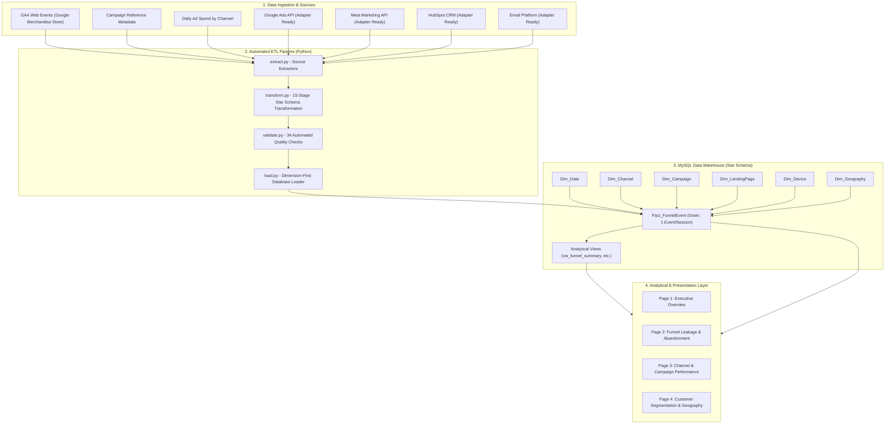

# System Architecture Documentation

## 1. High-Level Architecture

The system is architected as a modular, decoupled Business Intelligence and Decision Support pipeline designed to process granular digital marketing events into an analytical Star Schema data warehouse, exposing optimized views and DAX metrics for Power BI Desktop.

## 2. Ingestion Tier
* **Primary Digital Event Source**: Google Analytics 4 (GA4) export capturing granular user actions (`session_start`, `page_view`, `view_item`, `add_to_cart`, `begin_checkout`, `purchase`).
* **Campaign & Channel Metadata**: Campaign mapping tables standardizing campaign identifiers, objectives, and channel groupings.
* **Ad Spend Integration**: Daily expenditure datasets per campaign allowing accurate calculation of CPA and ROAS.
* **External API Adapters**: Pre-built adapter interfaces for Google Ads, Meta Marketing API, HubSpot CRM, and Email platforms configured to gracefully handle unauthenticated environments without fabricated live calls.

## 3. Transformation & Normalization Tier
* **Event Deduplication**: Filters identical `event_id` occurrences preserving data integrity.
* **Funnel Mapping**: Maps heterogeneous platform events into a canonical 7-stage funnel model:
  1. `IMPRESSION`
  2. `CLICK`
  3. `LANDING_PAGE`
  4. `PRODUCT_VIEW`
  5. `CART`
  6. `CHECKOUT`
  7. `PURCHASE`
* **Spend Attribution**: Allocates daily spend across top-of-funnel impression records avoiding downstream multi-touch double-counting.
* **Dimension Normalization**: Extracts unique entities and assigns deterministic surrogate primary keys.

## 4. Star Schema Storage Tier
* **Fact Table**: `Fact_FunnelEvent` enforces referential integrity via strict foreign keys to all six dimension tables.
* **Indexing Strategy**: B-Tree composite indexes on `(Funnel_Stage, Date_ID)`, `(Channel_ID, Funnel_Stage)`, and `(Campaign_ID, Funnel_Stage)` guarantee sub-second analytical query responses.
* **Pre-Aggregated Views**: 8 specialized views (`vw_funnel_summary`, `vw_channel_performance`, `vw_device_performance`, etc.) serve as optimized data sources for BI tools.
