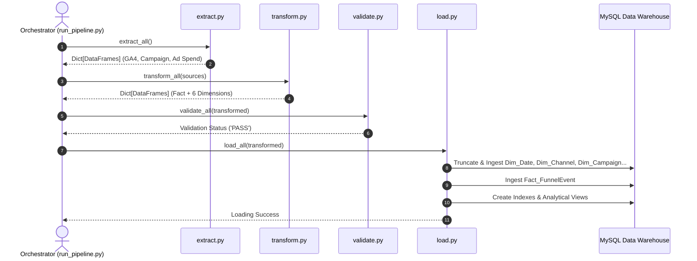

# ETL Pipeline Technical Documentation

---

## 1. Overview & Pipeline Philosophy

The ETL pipeline (`etl/run_pipeline.py`) transforms multi-channel digital marketing event logs into an analytical dimensional schema.

### Core Principles
1. **Never Fabricate Live Calls**: Live external APIs requiring authenticated credentials execute through structured mock/stub interfaces.
2. **Deterministic Processing**: All date parsing, key generation, and stage mappings produce identical results across runs.
3. **Dimension-First Loading**: Dimensions are updated before facts, ensuring zero foreign-key constraint violations.
4. **Idempotence**: The pipeline can be executed repeatedly without causing duplicate entries or schema corruption.

---

## 2. Pipeline Modules & Execution Sequence

---

## 3. Step-by-Step Transformation Details

1. **Standardize Column Names**: Cleans column names to lower snake_case.
2. **Timestamp Normalization**: Converts raw Unix microsecond integer timestamps to standard UTC `DATETIME`.
3. **Canonical Funnel Stage Mapping**: Maps GA4 events to 7 stages (`IMPRESSION` to `PURCHASE`). Unmapped events are pruned.
4. **Channel Normalization**: Classifies `traffic_source_medium` into 7 standardized channels.
5. **Campaign Resolution**: Joins campaign metadata to retrieve campaign objectives and budgets.
6. **Device & Geography Normalization**: Normalizes nulls and formats device types, OS, browser, country, and cities.
7. **Landing Page Classification**: Extracts paths and assigns functional categories (Home, Bags, Apparel, Electronics).
8. **Revenue Isolation**: Enforces revenue strictly on `PURCHASE` stages.
9. **Ad Spend Proportional Allocation**: Daily campaign expenditure is attributed across top-of-funnel impression records to prevent double-counting.
10. **Dimension Extraction & Surrogate Key Generation**: Populates dimension DataFrames with clean, non-null primary keys.
11. **Fact Table Assembling**: Performs surrogate key lookups to replace natural keys with integer IDs.

---

## 4. Error Recovery & Exception Handling Strategy

* **Schema Inconsistencies**: Automatically reported with specific field errors.
* **Database Connection Failures**: Detailed connection parameters printed; system informs user to adjust `.env`.
* **Foreign Key Violations**: Handled by pre-sorting loads and running pre-load validation checks.
