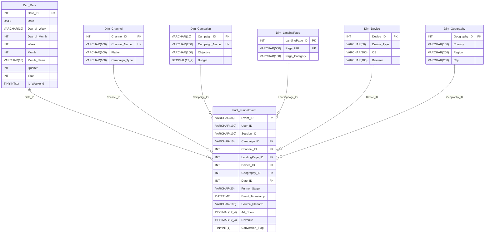

# DATABASE DESIGN SPECIFICATION: STAR SCHEMA

**Course**: Business Intelligence (TAE 2 Winter 2026)  
**Database Name**: `marketing_funnel_dw`  
**RDBMS**: MySQL Community Server 8.0.42 (Engine: InnoDB, Charset: utf8mb4)  
**Schema Architecture**: Dimensional Star Schema (1 Central Fact Table, 6 Conformed Dimensions)

---

## 1. Entity-Relationship Diagram (Star Schema)

---

## 2. Table Specifications & Cardinalities

### 2.1 Fact Table: `Fact_FunnelEvent`
* **Grain**: One record = One standardized customer journey event for a user/session at a specific funnel stage.
* **Verified MySQL Row Count**: **57,083 rows**
* **Primary Key**: `Event_ID` (UUID string, unique identifier per event)
* **Measures**:
  - `Ad_Spend` (`DECIMAL(12,4)`): Total allocated marketing media expenditure in USD. Total in DB: **\$243,209.53**.
  - `Revenue` (`DECIMAL(12,4)`): Monetary transaction value in USD. Populated strictly when `Funnel_Stage = 'PURCHASE'`. Total in DB: **\$355,403.85**.
  - `Conversion_Flag` (`TINYINT(1)`): Binary indicator (1 if purchase, 0 otherwise). Total purchases: **1,361**.
* **Foreign Keys**:
  - `Campaign_ID` → `Dim_Campaign(Campaign_ID)` ON DELETE SET NULL ON UPDATE CASCADE
  - `Channel_ID` → `Dim_Channel(Channel_ID)` ON DELETE SET NULL ON UPDATE CASCADE
  - `LandingPage_ID` → `Dim_LandingPage(LandingPage_ID)` ON DELETE SET NULL ON UPDATE CASCADE
  - `Device_ID` → `Dim_Device(Device_ID)` ON DELETE SET NULL ON UPDATE CASCADE
  - `Geography_ID` → `Dim_Geography(Geography_ID)` ON DELETE SET NULL ON UPDATE CASCADE
  - `Date_ID` → `Dim_Date(Date_ID)` ON DELETE SET NULL ON UPDATE CASCADE
* **Check Constraint**: `CHECK (Funnel_Stage IN ('IMPRESSION', 'CLICK', 'LANDING_PAGE', 'PRODUCT_VIEW', 'CART', 'CHECKOUT', 'PURCHASE'))`

---

### 2.2 Dimension Tables

| Dimension | Primary Key | Key Type | Verified Row Count | Natural Attributes |
|:---|:---|:---:|:---:|:---|
| **`Dim_Date`** | `Date_ID` | Surrogate (YYYYMMDD) | **366** | `Date`, `Day_of_Week`, `Day_of_Month`, `Week`, `Month`, `Month_Name`, `Quarter`, `Year`, `Is_Weekend` |
| **`Dim_Channel`** | `Channel_ID` | Surrogate (`INT AUTO_INCREMENT`) | **5** | `Channel_Name` (Unique), `Platform`, `Campaign_Type` |
| **`Dim_Campaign`**| `Campaign_ID`| Business Key (`VARCHAR(10)`) | **7** | `Campaign_Name` (Unique), `Objective`, `Budget` |
| **`Dim_LandingPage`**| `LandingPage_ID`| Surrogate (`INT AUTO_INCREMENT`) | **3** | `Page_URL` (Unique), `Page_Category` |
| **`Dim_Device`** | `Device_ID` | Surrogate (`INT AUTO_INCREMENT`) | **18** | `Device_Type`, `OS`, `Browser` (Unique composite key) |
| **`Dim_Geography`**| `Geography_ID`| Surrogate (`INT AUTO_INCREMENT`) | **500** | `Country`, `Region`, `City` (Unique composite key) |

---

## 3. Performance Indexing Strategy

18 B-Tree indexes are deployed to ensure sub-second query latency during analytical aggregation:
- `idx_fact_funnel_stage` on `Fact_FunnelEvent(Funnel_Stage)`
- `idx_fact_date` on `Fact_FunnelEvent(Date_ID)`
- `idx_fact_channel` on `Fact_FunnelEvent(Channel_ID)`
- `idx_fact_campaign` on `Fact_FunnelEvent(Campaign_ID)`
- `idx_fact_device` on `Fact_FunnelEvent(Device_ID)`
- `idx_fact_geography` on `Fact_FunnelEvent(Geography_ID)`
- `idx_fact_landingpage` on `Fact_FunnelEvent(LandingPage_ID)`
- `idx_fact_user` on `Fact_FunnelEvent(User_ID)`
- `idx_fact_session` on `Fact_FunnelEvent(Session_ID)`
- `idx_fact_timestamp` on `Fact_FunnelEvent(Event_Timestamp)`
- `idx_fact_conversion` on `Fact_FunnelEvent(Conversion_Flag)`
- Composite `idx_fact_stage_date` on `Fact_FunnelEvent(Funnel_Stage, Date_ID)`
- Composite `idx_fact_channel_stage` on `Fact_FunnelEvent(Channel_ID, Funnel_Stage)`
- Composite `idx_fact_campaign_stage` on `Fact_FunnelEvent(Campaign_ID, Funnel_Stage)`
- Dimension indexes on Date (`idx_date_year_month`, `idx_date_quarter`), Geography (`idx_geo_country`), and Device (`idx_device_type`).

---

## 4. Analytical Views

The warehouse exposes 9 pre-aggregated SQL views:
1. `vw_funnel_summary`: Funnel event counts, unique users, and unique sessions per stage.
2. `vw_funnel_conversion`: Stage-to-stage transition rates and drop-off percentages.
3. `vw_channel_performance`: Channel revenue, spend, ROAS, CPA, and conversion rate.
4. `vw_campaign_performance`: Campaign-level financial return metrics.
5. `vw_device_performance`: Device category, OS, and browser conversion metrics.
6. `vw_geography_performance`: Country, regional, and municipal conversion metrics.
7. `vw_landingpage_performance`: Conversion rates by catalog entry point.
8. `vw_daily_trend`: Daily user, session, purchase, revenue, and spend trajectory.
9. `vw_monthly_trend`: Monthly rollups for executive run-rate tracking.
