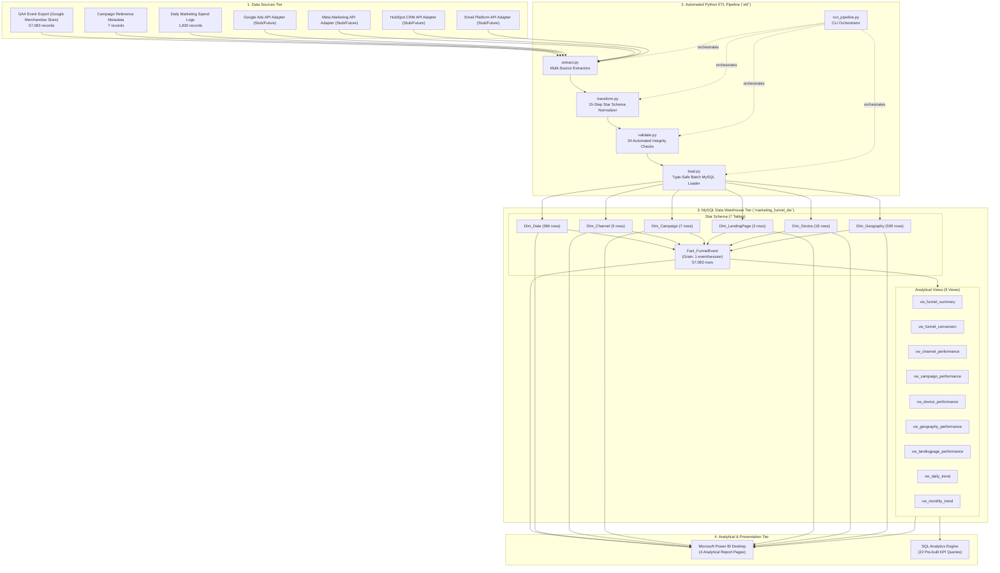

# SYSTEM ARCHITECTURE SPECIFICATION

**Project Title**: Cross-Channel Marketing Funnel Leakage Intelligence: A Business Intelligence Approach for Customer Journey Optimization  
**Repository**: `business-intelligence-funnel-leakage`  
**Database**: MySQL 8.0 (`marketing_funnel_dw`)  
**BI Platform**: Microsoft Power BI Desktop

---

## 1. High-Level End-to-End Architecture

The system implements a decoupled, four-tier Business Intelligence data pipeline that ingests raw digital marketing touchpoints, normalizes them into a canonical event model, validates data quality across 34 automated constraints, loads them into an analytical MySQL Star Schema data warehouse, and surfaces business insights through Power BI Desktop and SQL analytics.

---

## 2. Component Descriptions & Responsibilities

| Tier | Component | File / Path | Core Responsibility |
|:---|:---|:---|:---|
| **Sources** | Raw Datasets | `data/raw/ga4/` | Holds raw CSV data: GA4 events, campaign dimensions, and daily ad spend. |
| **Sources** | API Stubs | `etl/extract.py` | Adapters for Google Ads, Meta, HubSpot, and Email. Explicitly marked as non-authenticated stubs (no fabricated calls). |
| **ETL** | Extractor | `etl/extract.py` | Reads CSV sources into pandas DataFrames; enforces raw value preservation. |
| **ETL** | Transformer | `etl/transform.py` | 15-step transformation: normalizes timestamps, standardizes columns, maps canonical 7-stage funnel, attributes ad spend, deduplicates, and constructs dimension lookups. |
| **ETL** | Validator | `etl/validate.py` | Runs 34 assertions verifying row counts, primary key nulls/duplicates, foreign key integrity, non-negative financials, and valid funnel stages. |
| **ETL** | Loader | `etl/load.py` | Connects to MySQL via `mysql-connector-python`, executes idempotent DDL (comment-safe SQL parser), converts types (pandas `Timestamp` → `datetime.datetime`, `NaT`/`nan`/`NA` → `None`, numpy scalars → native Python types), enforces dimension-first dependency loading, builds indexes and views, and verifies row counts. |
| **ETL** | Runner | `etl/run_pipeline.py` | Command-line interface coordinating Phases 1 through 4 with timing, exit codes, and summary reports. |
| **Warehouse** | DDL Scripts | `sql/` | SQL definitions for database, 6 dimensions, 1 fact table, 18 indexes, 9 analytical views, 22 KPI queries, and validation tests. |
| **Warehouse** | Tables & Views | `marketing_funnel_dw` | MySQL 8.0 relational database holding conformed Star Schema and pre-aggregated views. |
| **Analytics** | Power BI | `powerbi/` | 4-page dashboard specification, DAX measure library, and setup guides. |

---

## 3. Data Flow Specification

1. **Extraction**: `extract.py` loads `ga4_events.csv` (57,083 rows), `campaign_data.csv` (7 rows), and `ad_spend.csv` (1,830 rows). Missing external APIs are safely reported as non-available stubs.
2. **Transformation**:
   - `event_timestamp` (Unix microseconds) is normalized to UTC `datetime`.
   - `event_name` values are mapped into canonical funnel stages: `session_start`/`first_visit` → `IMPRESSION`, `click` → `CLICK`, `page_view` → `LANDING_PAGE`, `view_item` → `PRODUCT_VIEW`, `add_to_cart` → `CART`, `begin_checkout` → `CHECKOUT`, `purchase` → `PURCHASE`.
   - Traffic source mediums are normalized into conformed channels: `Paid Search`, `Organic Search`, `Social`, `Email`, `Direct`.
   - Daily campaign ad spend is allocated to `IMPRESSION` events to prevent downstream multi-stage double counting (\$243,209.53 allocated).
   - Revenue (\$355,403.85) is strictly verified to reside on `PURCHASE` events only.
   - Surrogate keys are assigned, producing 6 dimension DataFrames and 1 fact DataFrame.
3. **Validation**: `validate.py` performs 34 checks across all tables and outputs `data/validation/validation_report.csv`.
4. **Loading**: `load.py` connects to MySQL, parses SQL DDL, truncates tables for idempotence, batch-inserts dimensions first, batch-inserts `Fact_FunnelEvent` second, applies B-Tree indexes, creates analytical views, and issues direct `SELECT COUNT(*)` queries to confirm database rows.
5. **Consumption**: Power BI Desktop and SQL queries connect to `marketing_funnel_dw` to evaluate KPIs and visualize funnel leakage.
